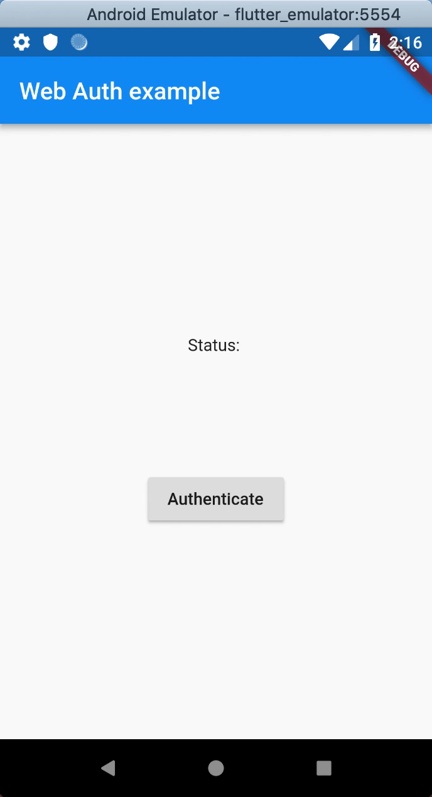

# Web Auth for Flutter

A Flutter plugin for authenticating a user with a web service, even if the web service is run by a third party. Most commonly used with OAuth2, but can be used with any web flow that can redirect to a custom scheme.

In the background, this plugin uses [`ASWebAuthenticationSession`][ASWebAuthenticationSession] on iOS 12 and newer, `SFAuthenticationSession` on iOS 11, and [Chrome Custom Tabs][Chrome Custom Tabs] on Android.

[ASWebAuthenticationSession]: https://developer.apple.com/documentation/authenticationservices/aswebauthenticationsession
[SFAuthenticationSession]: https://developer.apple.com/documentation/safariservices/sfauthenticationsession
[Chrome Custom Tabs]: https://developer.chrome.com/multidevice/android/customtabs

| **iOS**                | **Android**                    |
| ---------------------- | ------------------------------ |
|  |  |

## Usage

To authenticate against your own custom site:

```dart
import 'package:flutter_web_auth/flutter_web_auth.dart';

// Present the dialog to the user
final result = await FlutterWebAuth.authenticate(url: "https://my-custom-app.com/connect", callbackUrlScheme: "my-custom-app");

// Extract token from resulting url
final token = Uri.parse(result).queryParameters['token']
```

To authenticate the user using Google's OAuth2:

```dart
import 'package:flutter_web_auth/flutter_web_auth.dart';

import 'dart:convert' show jsonDecode;
import 'package:http/http.dart' as http;

// App specific variables
final googleClientId = 'XXXXXXXXXXXX-xxxxxxxxxxxxxxxxxxxxxxxxxxxxxxxx.apps.googleusercontent.com';
final callbackUrlScheme = 'com.googleusercontent.apps.XXXXXXXXXXXX-xxxxxxxxxxxxxxxxxxxxxxxxxxxxxxxx';

// Construct the url
final url = Uri.https('accounts.google.com', '/o/oauth2/v2/auth', {
  'response_type': 'code',
  'client_id': googleClientId,
  'redirect_uri': '$callbackUrlScheme:/',
  'scope': 'email',
});

// Present the dialog to the user
final result = await FlutterWebAuth.authenticate(url: url.toString(), callbackUrlScheme: callbackUrlScheme);

// Extract code from resulting url
final code = Uri.parse(result).queryParameters['code'];

// Use this code to get an access token
final response = await http.post('https://www.googleapis.com/oauth2/v4/token', body: {
  'client_id': googleClientId,
  'redirect_uri': '$callbackUrlScheme:/',
  'grant_type': 'authorization_code',
  'code': code,
});

// Get the access token from the response
final accessToken = jsonDecode(response.body)['access_token'] as String;
```

## Setup

Setup works as for any Flutter plugin, expect the Android caveat outlined below:

### Android

In order to capture the callback url, the following `activity` needs to be added to your `AndroidManifest.xml`. Be sure to relpace `YOUR_CALLBACK_URL_SCHEME_HERE` with your actual callback url scheme.

```xml
<manifest>
  <application>

    <activity android:name="com.linusu.flutter_web_auth.CallbackActivity" >
      <intent-filter android:label="flutter_web_auth">
        <action android:name="android.intent.action.VIEW" />
        <category android:name="android.intent.category.DEFAULT" />
        <category android:name="android.intent.category.BROWSABLE" />
        <data android:scheme="YOUR_CALLBACK_URL_SCHEME_HERE" />
      </intent-filter>
    </activity>

  </application>
</manifest>
```
